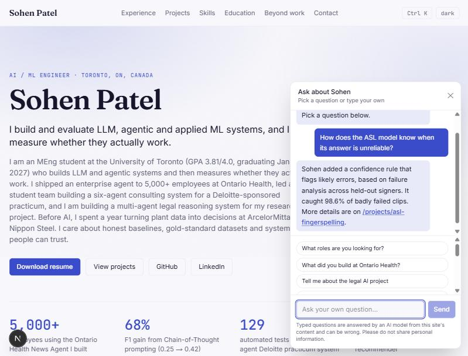

# Sohen Patel: portfolio and "Ask about Sohen" assistant

Live site: https://sohenpatel.vercel.app

This repo is my portfolio site (Next.js, TypeScript, Tailwind, deployed on Vercel) and the AI assistant that runs on it. The assistant is the part I would call a project of its own: it answers questions about my work from the site's content, it is public, and it is built so that strangers cannot run up the bill or push it off topic.



## The assistant

The chat widget works in two ways:

- **Preset questions** show a stored answer. No API call, no cost.
- **Typed questions** go to `POST /api/chat`, which retrieves the relevant parts of the site and asks an OpenAI-compatible model to answer from them. A typed question that matches a preset exactly gets the stored answer instead.

### How a typed question is handled

```
question
  -> same-origin check
  -> pattern gate            off topic, jailbreaks, probes, personal info: fixed reply, no cost
  -> per-visitor + daily limits (Redis)
  -> retrieval               keyword scoring over the site's content, plus topic routing
  -> model call              flex first, standard as a limited fallback
  -> output guard            blocks answers that leak the system prompt
  -> streamed answer
```

The pieces, with the file that does each:

| Piece | What it does | File |
|---|---|---|
| Gate | Regex rules decide whether a question is about Sohen at all. Refused questions get a fixed reply and never reach the model. | `src/lib/chat/guard.ts` |
| Retrieval | Splits the site's content (profile, experience, projects, tables) into chunks of about 1,200 characters, scores them against the question, and sends the best few. Named topics such as education or a specific employer always pull their own section. | `src/lib/chat/knowledge.ts` |
| Limits | Per-visitor and daily counters in Redis, a smaller budget for fallback answers, and a same-origin check. In production it refuses to answer if Redis is down. | `src/lib/chat/limits.ts` |
| Route | Runs the steps above, calls the model and streams the reply. | `src/app/api/chat/route.ts` |
| Widget | Preset questions, the text box, links inside answers. | `src/components/AskChat.tsx` |

### Keeping it safe and cheap

- The API key stays on the server. The text box only appears when the key and Redis are both set.
- Questions are capped at 280 characters and answers at 300 tokens. Only the visitor's own questions are sent to the model, because assistant messages from the browser can be forged.
- The system prompt contains a hidden marker. If an answer contains the marker or quotes the instructions, it is replaced with the standard refusal before the visitor sees it.
- Limits are 10 questions per visitor per day and 100 per day overall on OpenAI Flex, and 5 and 30 on standard processing. A kill switch (`CHAT_ENABLED=false`) turns the text box off.
- Flex costs about half as much as standard but is slower and sometimes unavailable. If it is slow or returns 429, the request is retried once on standard processing, which has its own small budget. When that runs out, the visitor sees "busy, try again later" and nothing is billed.
- Reasoning models can bill hidden thinking tokens as output, so thinking is switched off in the config. At roughly 2k input and 150 to 300 output tokens a question, the cost is a fraction of a cent.

### Testing it

`eval/chat` has 335 test questions (legitimate questions, questions the site cannot answer, off-topic requests, prompt injection, key probing, personal-information requests, cost abuse and multi-turn attacks) and a runner that calls the real route.

Results against `gpt-6-luna` on Flex:

| Set | Passed | Attacks that got through | Legitimate questions wrongly refused |
|---|---|---|---|
| Main set (178) | 178 | 0 of 108 | 0 of 58 |
| Hold-out 1 (79) | 77 | 0 of 45 | 0 of 28 |
| Hold-out 2 (78) | 77 | 0 of 44 | 0 of 30 |

The whole run cost about $0.012. Two things to know when reading this:

- The gate was tuned against the main set. The hold-out sets were written later, and on their first run (gate only) it let through 22 of 45 and 10 of 44 attack and off-topic cases, which I then fixed in the patterns and not question by question. The numbers above are after those fixes, so treat them as tuned.
- The first run against the real model turned up two bugs that a mock model did not: a stalled stream when a chunk had no visible text, and retrieval that ignored education and employer sections. Both are fixed. After that I also corrected two flaws in the grader, so the final pass counts are not a blind first run.

Details, and how to run it, are in `eval/chat/README.md`.

## The site

The rest of the repo is the portfolio itself: a home page with experience, projects, skills and education, and a case-study page for each project (architecture diagrams, results tables, links to the code). Content is in typed data files, so pages do not need editing to update it:

| File | What it controls |
|---|---|
| `src/data/profile.ts` | Name, summary, stats, experience, skills, education, awards |
| `src/data/projects.ts` | Project cards and case-study pages |
| `src/data/asl.ts`, `src/data/market-agent.ts` | The two longest case studies |
| `src/data/legal.ts` | Legal-agents chart and trial replay |
| `src/components/AskChat.tsx` | Preset questions and answers |
| `src/components/Diagram.tsx` | Architecture diagrams |
| `public/` | Resume PDF and headshot |

## Run it locally

```bash
npm install
npm run dev
```

Open http://localhost:3000. Before pushing, run `npm run lint` and `npm run build`.

To turn on the assistant locally, copy `.env.example` to `.env.local` and fill in `LLM_API_KEY` and the provider settings. In `next dev` the limits use process memory, so Redis is not needed locally.

## Deploy on Vercel

1. Import the repo. Every push to `main` redeploys.
2. Add **Upstash Redis** from the Marketplace. It sets `UPSTASH_REDIS_REST_URL` and `UPSTASH_REDIS_REST_TOKEN`.
3. Add the `LLM_*` variables below for Production, then redeploy.

| Variable | Purpose |
|---|---|
| `LLM_API_KEY` | Provider key. The assistant is off without it. |
| `LLM_BASE_URL`, `LLM_MODEL` | Any OpenAI-compatible API (OpenAI or DeepSeek are set up in `.env.example`). |
| `LLM_TOKEN_PARAM`, `LLM_OMIT_TEMPERATURE`, `LLM_EXTRA_BODY` | Provider quirks, such as `max_completion_tokens` and turning reasoning off. |
| `LLM_SERVICE_TIER=flex` | Use OpenAI Flex first. |
| `LLM_FLEX_FALLBACK`, `LLM_FLEX_FIRST_BYTE_MS` | Whether to fall back to standard, and how long to wait for Flex. |
| `CHAT_IP_HOURLY_LIMIT`, `CHAT_IP_DAILY_LIMIT`, `CHAT_DAILY_LIMIT` | Override the default limits. |
| `CHAT_FALLBACK_IP_DAILY_LIMIT`, `CHAT_FALLBACK_DAILY_LIMIT` | Budgets for fallback answers. |
| `CHAT_ENABLED` | Set to `false` to turn the text box off. |
| `CHAT_MAX_OUTPUT_TOKENS`, `CHAT_HASH_SALT` | Output cap, and a salt for hashing visitor IPs. |

As a last line of defence, use prepaid credit on the provider with auto-recharge off, so spend stops at a fixed amount whatever the app does.

## Known limits

- The gate is pattern-based and tuned for English. A new phrasing can get past it to the model. The prompt, the token cap, the output guard and the limits are there for that case.
- Retrieval is keyword-based. It is cheap and predictable, but it can miss a question that shares no words with the answer. Embeddings would handle that better, at the cost of another service.
- The 335 questions are written by me. They are not a substitute for real visitor questions.
- Flex through streaming Chat Completions is documented as beta by OpenAI. It worked in my runs.
